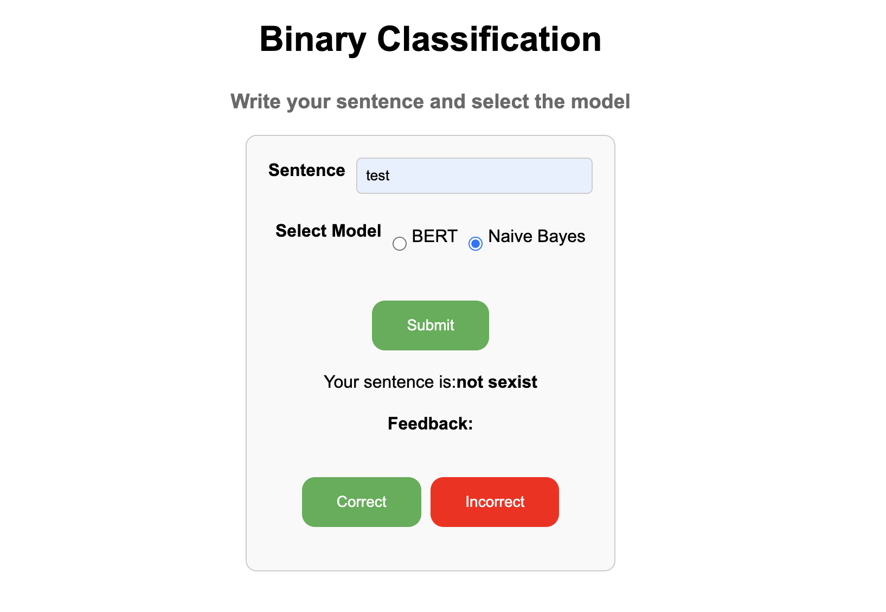

# Binary classification for sexist sentences
The final result of this project is a WebApp built with Angular and Python that allows you to classify a sentence, and help to train the dataset thanks to you feedback! Cool, right?



## How to reproduce the experiment
To run the project you need
- Python3
- pip3

Once set up your Python environment you need to install some libraries like PyTorch, pandas ...
```
pip3 install pandas
pip3 install torch
pip3 install matplotlib
pip3 install seaborn
pip3 install scikit-learn
pip3 install transformers
pip3 install joblib
```
## How to train the models

#### BERT
If you want to train BERT you need to run the `sentiment_analysis_bert.py` script.
If you are on MacOS everything is fine, if you are on Linux/Windows you need to change the device used for training from `mps` to `cuda`
```
device = torch.device("mps" if torch.backends.mps.is_available() else "cpu")
```
to
```
device = torch.device("cuda" if torch.backends.mps.is_available() else "cpu")
```

#### Naive Bayes
If you want to train the Naive Bayes you need to run the `sentiment_analysis_naive_bayes.py` script.

## How to test the models

#### BERT
If you want to test BERT you need to run the `test_bert.py` script.
If you are on MacOS everything is fine, if you are on Linux/Windows you need to change the device used for training from `mps` to `cuda`
```
device = torch.device("mps" if torch.backends.mps.is_available() else "cpu")
```
to
```
device = torch.device("cuda" if torch.backends.mps.is_available() else "cpu")
```

#### Naive Bayes
If you want to test the Naive Bayes you need to run the `test_naive.py` script.
